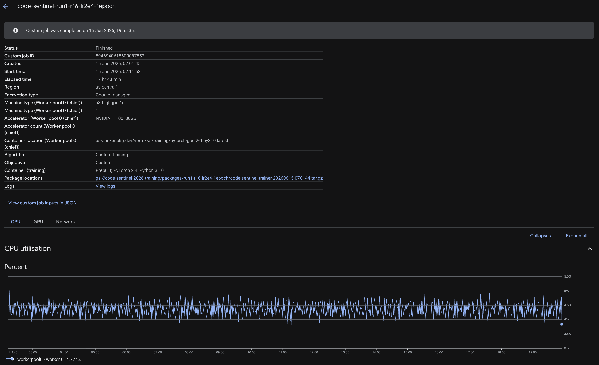
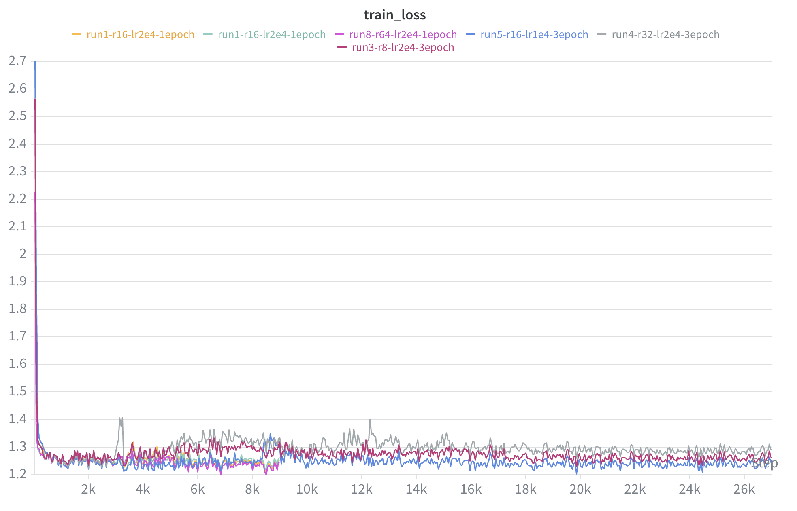
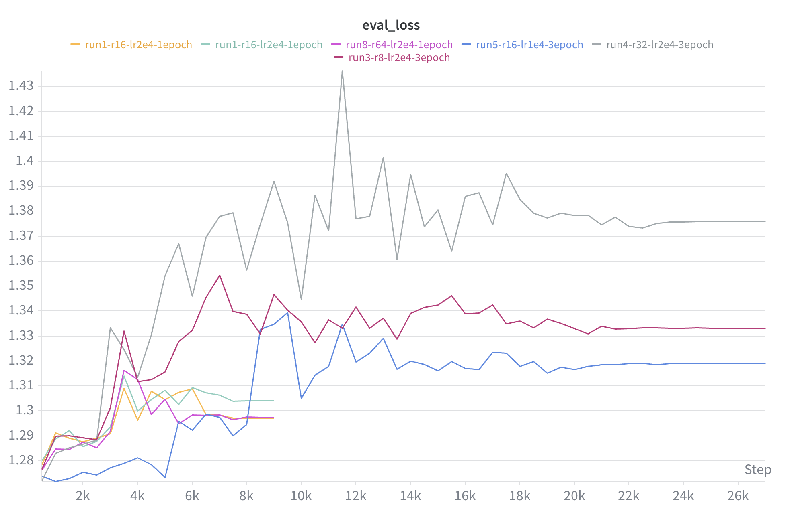
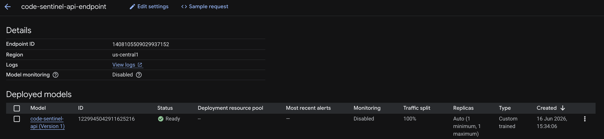
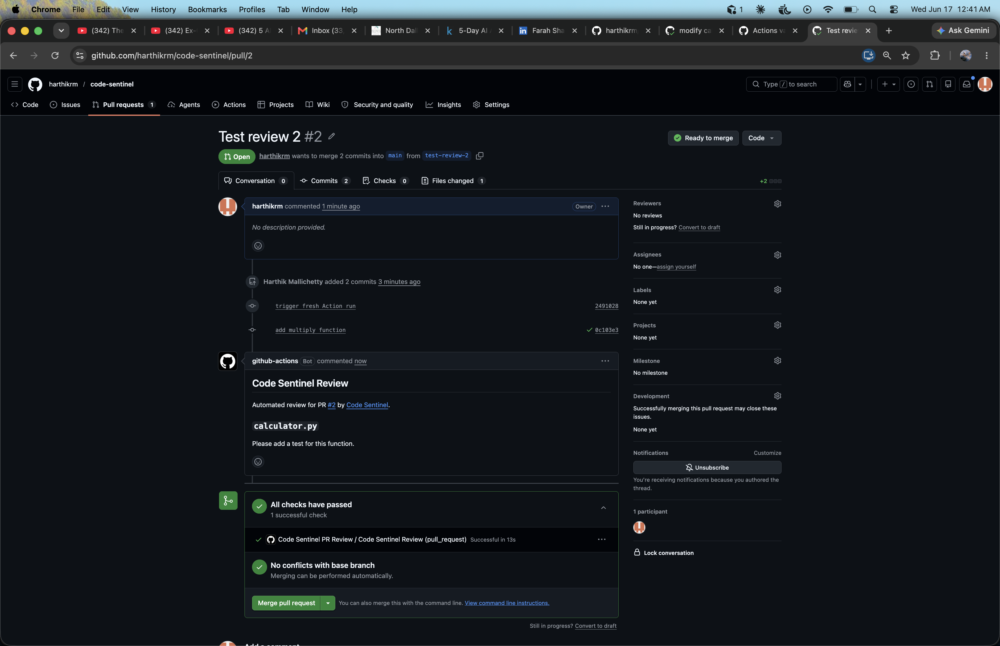

# Code Sentinel

[](https://www.python.org/)
[](https://pytorch.org/)
[](https://cloud.google.com/vertex-ai)
[](https://wandb.ai/)

**Fine-tuned [Mistral-7B-Instruct-v0.3](https://huggingface.co/mistralai/Mistral-7B-Instruct-v0.3) for automated, actionable code review on real pull-request diffs — deployed on Google Vertex AI with a GitHub Action that posts AI-generated reviews on every PR.**

**Repository:** [github.com/harthikrm/code-sentinel](https://github.com/harthikrm/code-sentinel)

---

## What It Is

Code Sentinel is an end-to-end automated code review system. It fine-tunes Mistral-7B on **143K real human reviewer comments** from Microsoft's [CodeReviewer](https://zenodo.org/record/7650861) dataset, evaluates against base Mistral and GPT-4o-mini with BERTScore, and serves inference through a FastAPI container on Vertex AI. A GitHub Action calls the API on every pull request and posts an aggregated review comment.

**The problem:** At scale, senior engineers become the bottleneck for PR review. Generic LLMs give surface-level feedback but miss the patterns experienced reviewers actually use — concise, contextual comments tied to specific diff hunks. Code Sentinel learns those patterns from real review data.

---

## Results

BERTScore F1 on **500 held-out test examples** (English, `distilbert-base-uncased`):

| Model | BERTScore F1 | vs. Base |
|-------|-------------|----------|
| Base Mistral-7B-Instruct | 0.7149 | — |
| **Code Sentinel (run1)** | **0.7470** | **+4.5%** |
| GPT-4o-mini | 0.7041 | +6.1% vs. GPT-4o-mini |

Evaluation script: [`evaluation/compare_models.py`](evaluation/compare_models.py)

---

## Architecture

```mermaid
flowchart LR
    subgraph Data
        A[CodeReviewer raw JSONL] --> B[data/preprocess.py]
        B --> C[Filtered JSONL splits]
        C --> D[(GCS bucket)]
    end

    subgraph Training
        D --> E[training/train.py]
        E --> F[QLoRA on H100]
        F --> G[LoRA checkpoints]
        G --> H[serving/merge_adapters.py]
        H --> I[Merged model on GCS]
    end

    subgraph Serving
        I --> J[serving/api.py FastAPI]
        J --> K[Vertex AI Endpoint]
    end

    subgraph Integration
        K --> L[github_action/review_pr.py]
        L --> M[GitHub PR comment]
    end
```



| Stage | Key files | Output |
|-------|-----------|--------|
| **Data pipeline** | `data/preprocess.py`, `data/load_dataset.py`, `data/utils.py` | Filtered `[INST]`-formatted JSONL |
| **Training** | `training/config.py`, `training/train.py`, `trainer/` | LoRA adapters + W&B metrics |
| **Merge** | `serving/merge_adapters.py` | Full merged weights on GCS |
| **Evaluation** | `evaluation/compare_models.py`, `notebooks/02_baseline_evaluation.ipynb` | BERTScore vs. base / GPT-4o-mini |
| **Deploy** | `serving/api.py`, `serving/deploy_api.py`, `serving/vertex_deploy.py` | Vertex AI online prediction endpoint |
| **PR bot** | `github_action/review_pr.py`, `.github/workflows/code_review.yml` | Automated review comments |

---

## Screenshots

| Vertex AI training (H100) | W&B train loss |
|:---:|:---:|
|  |  |

| W&B eval loss | Vertex AI endpoint |
|:---:|:---:|
|  |  |

| GitHub Action PR review |
|:---:|
|  |

---

## Dataset

**Source:** [Microsoft CodeReviewer](https://zenodo.org/record/7650861) on Zenodo (~6.9 GB raw)

**Languages:** Python, Java, JavaScript, C#, C++, Go

**Quality filters** (`data/preprocess.py`):

- Minimum 20-character comment length
- Removed bot comments: URLs, static-analysis rule codes (e.g. `E501`), tool references (e.g. `[flake8]`, `[pylint]`)
- English only

| Split | Examples |
|-------|----------|
| Train | 143,996 |
| Validation | 12,545 |
| Test | 12,517 |
| **Total (filtered)** | **169,058** |

**GCS:** `gs://code-sentinel-2026-training/data/`

Each example uses the Mistral `[INST]...[/INST]` template with language tag, diff hunk, and human reviewer comment.

---

## Model & Training

| Setting | Value |
|---------|-------|
| Base model | `mistralai/Mistral-7B-Instruct-v0.3` (~14 GB, 7B params) |
| Method | QLoRA — 4-bit NF4 via `bitsandbytes` (~4 GB VRAM at load) |
| LoRA rank / alpha | r=16, α=32, dropout=0.05 |
| Target modules | `q_proj`, `k_proj`, `v_proj`, `o_proj` |
| Trainable params | ~0.8% (adapters only) |
| Framework | HuggingFace TRL `SFTTrainer` |
| Learning rate | 2e-4, cosine schedule, warmup 0.03 |
| Batch | 1 × 16 gradient accumulation (effective 16) |
| Max sequence length | 1024 tokens |
| Precision | fp16 |
| GPU | NVIDIA H100 80GB (`a3-highgpu-1g`) on Vertex AI |
| Training time (run1) | ~18.7 h (9,000 steps @ ~5.5 s/step) |
| Checkpoints | Every 500 steps → GCS |
| Tracking | Weights & Biases + HuggingFace Hub backup |

Submit a Vertex training job:

```bash
python serving/vertex_deploy.py
```

Configs: [`training/config.py`](training/config.py) (run1–run10 with dictionary inheritance)

---

## Experiments

Hyperparameter search over LoRA rank, learning rate, and epoch count. All runs logged in W&B.

| Run | Rank | LR | Epochs | Train Loss | Eval Loss |
|-----|------|----|--------|------------|-----------|
| **run1** | 16 | 2e-4 | 1 | ~1.40 | ~1.29 |
| run3 | 8 | 2e-4 | 3 | ~1.30 | ~1.32 |
| run4 | 32 | 2e-4 | 3 | ~1.30 | ~1.38 |
| run5 | 16 | 1e-4 | 3 | ~1.30 | ~1.34 |
| run8 | 64 | 2e-4 | 1 | ~1.28 | ~1.30 |

**Key findings:**

- **run1** (1 epoch, r=16) achieved the best BERTScore F1 (**0.7470**) — one epoch was sufficient
- Lower rank (**r=8**, run3) achieved the best eval loss among 3-epoch runs (~1.32)
- Higher rank (**r=32**, run4) showed instability and worst eval loss (~1.38)
- Fine-tuned model beats base Mistral by **+4.5%** and GPT-4o-mini by **+6.1%** on held-out test set

---

## Infrastructure

| Resource | Location |
|----------|----------|
| GCP project | `code-sentinel-2026` |
| GCS bucket | `gs://code-sentinel-2026-training/` |
| Training data | `gs://code-sentinel-2026-training/data/` |
| Checkpoints | `gs://code-sentinel-2026-training/vertex-jobs/run1-r16-lr2e4-1epoch/model/` |
| Merged model | `gs://code-sentinel-2026-training/merged-model/run1/` (6 safetensor shards, ~27 GB) |
| Container image | `us-central1-docker.pkg.dev/code-sentinel-2026/code-sentinel/api:latest` |
| Serving GPU | H100 80GB (`a3-highgpu-1g`), `us-central1` |

---

## Inference API

### Deploy to Vertex AI

```bash
# Authenticate
gcloud auth application-default login
gcloud config set project code-sentinel-2026

# Build, push, and deploy (H100 serving; falls back to A100/L4 if quota exhausted)
python serving/deploy_api.py --gpu-profile h100

# Redeploy without rebuild
python serving/deploy_api.py --skip-build --skip-push --undeploy-existing --gpu-profile h100
```

### Local development

```bash
pip install -r requirements.txt
pip install -r serving/requirements.txt

export MODEL_PATH=gs://code-sentinel-2026-training/merged-model/run1
export GOOGLE_APPLICATION_CREDENTIALS=/path/to/service-account.json

uvicorn serving.api:app --host 0.0.0.0 --port 8080
```

`/health` returns `503` while the model downloads from GCS and loads; returns `200` when ready.

### Request / response

**`POST /review`** (direct FastAPI):

```bash
curl -X POST http://localhost:8080/review \
  -H "Content-Type: application/json" \
  -d '{"diff": "+ def foo():\n+   pass", "lang": "py"}'
```

```json
{"review": "Consider adding a docstring describing what this function does."}
```

**`POST /predict`** (Vertex AI envelope — used by GitHub Action):

```bash
curl --max-time 120 -X POST \
  -H "Authorization: Bearer $(gcloud auth print-access-token)" \
  -H "Content-Type: application/json" \
  "https://us-central1-aiplatform.googleapis.com/v1/projects/code-sentinel-2026/locations/us-central1/endpoints/YOUR_ENDPOINT_ID:predict" \
  -d '{"instances": [{"diff": "+ def foo():\n+   pass", "lang": "py"}]}'
```

```json
{"predictions": [{"review": "Consider adding a docstring describing what this function does."}]}
```

**Supported language tags:** `py`, `java`, `javascript`, `csharp`, `cpp`, `go` (mapped from file extensions in the PR bot).

---

## GitHub Actions PR Bot

The workflow in [`.github/workflows/code_review.yml`](.github/workflows/code_review.yml) triggers on PR `opened`, `synchronize`, and `reopened`. It fetches the diff, splits into per-file hunks, calls the Vertex `:predict` endpoint for each hunk, and posts one aggregated **Code Sentinel Review** comment.

**Tested on:** [harthikrm/code-sentinel PR #2](https://github.com/harthikrm/code-sentinel/pull/2) — bot posted *"Please add a test for this function."* on a `calculator.py` change.

### Setup

1. **Deploy the API** (see [Inference API](#inference-api)) and copy the full Vertex **`:predict` URL** (not `/review`).

2. **Create a GCP service account** with `roles/aiplatform.user` (or equivalent Vertex predict access). Download the JSON key.

3. **Add repository secrets** (Settings → Secrets and variables → Actions):

   | Secret | Value |
   |--------|-------|
   | `CODE_SENTINEL_API_URL` | Full Vertex predict URL, e.g. `https://us-central1-aiplatform.googleapis.com/v1/projects/code-sentinel-2026/locations/us-central1/endpoints/ENDPOINT_ID:predict` |
   | `GCP_SERVICE_ACCOUNT_KEY` | Raw JSON service account key (used by `google-github-actions/auth@v2`) |

   `GITHUB_TOKEN` is provided automatically; the workflow requests `pull-requests: write`.

4. **Copy the workflow** into your target repo (or enable it in this repo).

5. **Open a test PR** — the bot skips lock files, binaries, `node_modules`, and generated paths.

### How it works

```
PR opened/synced
  → checkout + pip install
  → google-github-actions/auth@v2  (sets Application Default Credentials)
  → review_pr.py
       → GitHub API: fetch diff
       → per hunk: POST :predict with {diff, lang}
       → aggregate reviews → post PR comment
```

Language detection: `.py`→`py`, `.js`→`javascript`, `.java`→`java`, `.go`→`go`, `.cs`→`csharp`, `.cpp`→`cpp`.

---

## Project Structure

```
code-sentinel/
├── data/                  # Preprocessing and dataset utilities
├── training/              # Local / config-driven training
├── trainer/               # Vertex AI training package (task.py, train.py)
├── serving/
│   ├── api.py             # FastAPI — /review, /predict, /health
│   ├── deploy_api.py      # Build + deploy to Vertex AI
│   ├── merge_adapters.py  # Merge LoRA into base weights
│   └── vertex_deploy.py   # Submit Vertex custom training jobs
├── evaluation/            # BERTScore 3-way comparison
├── notebooks/             # Baseline evaluation (MLX)
├── github_action/         # PR review bot script
├── docs/images/           # README screenshots (GCP, W&B, GitHub)
└── .github/workflows/     # code_review.yml
```

---

## Tech Stack

Python · PyTorch · HuggingFace Transformers · PEFT · TRL · bitsandbytes · MLX · FastAPI · uvicorn · Docker · Google Cloud (Vertex AI, GCS, Artifact Registry) · Weights & Biases · OpenAI API (GPT-4o-mini baseline) · BERTScore · gcsfs · GitHub Actions

---

## References

1. Dettmers, T., et al. (2023). **QLoRA: Efficient Finetuning of Quantized LLMs.** [arXiv:2305.14314](https://arxiv.org/abs/2305.14314)
2. Hu, E. J., et al. (2021). **LoRA: Low-Rank Adaptation of Large Language Models.** [arXiv:2106.09685](https://arxiv.org/abs/2106.09685)
3. Li, Z., et al. (2022). **CodeReviewer: Pre-Training for Automating Code Review Activities.** [arXiv:2203.09095](https://arxiv.org/abs/2203.09095)
4. Jiang, A. Q., et al. (2023). **Mistral 7B.** [arXiv:2310.06825](https://arxiv.org/abs/2310.06825)
